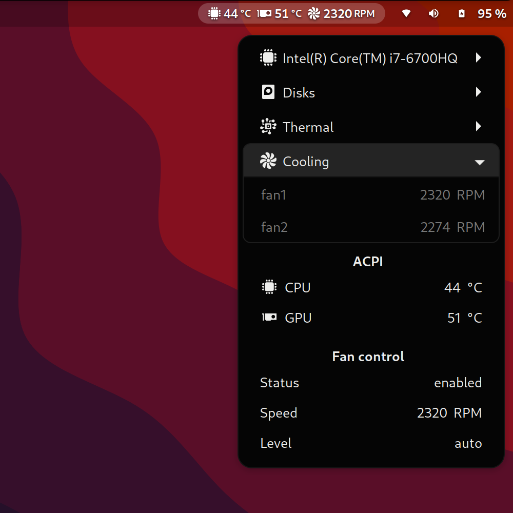

# ThinkPad Thermal GNOME Shell Extension
<b>Extension that displays thermal and fan status on ThinkPads</b>

Uses <code>thinkpad_acpi</code>, ie. values from
<code>/proc/acpi/ibm/thermal</code> and
<code>/proc/acpi/ibm/fan</code>.

Read more on https://www.kernel.org/doc/Documentation/laptops/thinkpad-acpi.txt

## Install

### GNOME Extensions Website

This extension is available on [GNOME Extensions Website](https://extensions.gnome.org/extension/986/thinkpad-thermal/).

### Manually

You can clone this repo and build the extension manually with <code>yarn build:package</code>, and extract the generated archive from <code>dist</code> to your extensions path, ie. <code>~/.local/share/gnome-shell/extensions/</code>.

