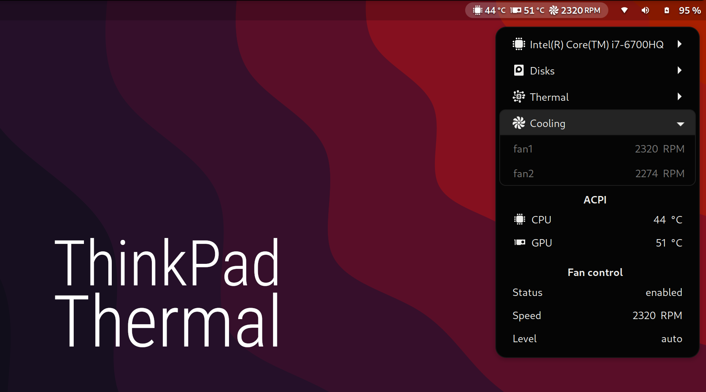

# ThinkPad Thermal GNOME Shell Extension
<b>Extension that displays thermal and fan status on ThinkPads</b>

## Requirements
- [thinkpad-acpi](https://www.kernel.org/doc/Documentation/laptops/thinkpad-acpi.txt), check contents of `/proc/acpi/ibm/thermal` and `/proc/acpi/ibm/fan`
- [lm-sensors](https://github.com/lm-sensors/lm-sensors), make sure to run `sensors-detect`
- `lscpu`
- `lsblk`

## Install

### GNOME Extensions Website

This extension is available on [GNOME Extensions Website](https://extensions.gnome.org/extension/986/thinkpad-thermal/).

### Manually

You can clone this repo and build the extension manually with <code>yarn build:package</code>, and extract the generated archive from <code>dist</code> to your extensions path, ie. <code>~/.local/share/gnome-shell/extensions/</code>.

## Todo
  - [x] Gnome 42
  - [x] thinkpad-acpi
  - [x] lm-sensors
  - [x] lscpu
  - [x] lsblk
  - [ ] Settings dialog
  - [ ] Gnome 43

\
\
\
\
\
Have fun!
