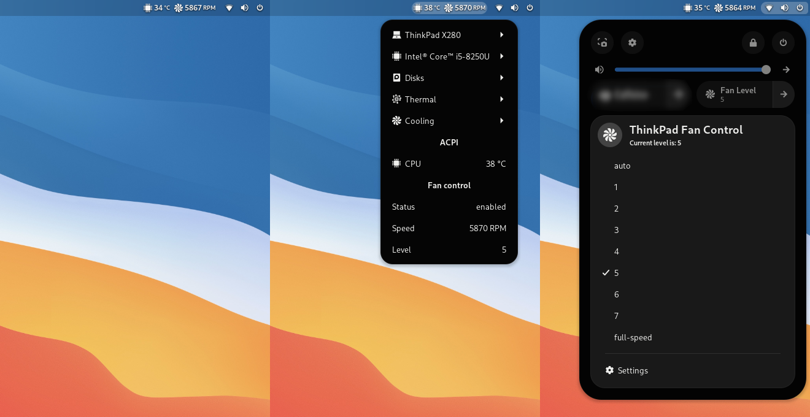

# ThinkPad Thermal GNOME Shell Extension
<b>Extension that displays device info, thermals and fan status on ThinkPads</b>

## Requirements
- [thinkpad-acpi](https://www.kernel.org/doc/Documentation/laptops/thinkpad-acpi.txt), check contents of `/proc/acpi/ibm/thermal` and `/proc/acpi/ibm/fan`
- [lm-sensors](https://github.com/lm-sensors/lm-sensors), make sure to run `sensors-detect`
- `lscpu`
- `lsblk`


## Install

### GNOME Extensions Website

This extension is available on [GNOME Extensions Website](https://extensions.gnome.org/extension/986/thinkpad-thermal/).

[](https://extensions.gnome.org/extension/986/thinkpad-thermal/)


### Manually

You can clone this repo and build the extension manually with `yarn build:package`, and extract the generated archive from `dist` to your extensions path, ie. `~/.local/share/gnome-shell/extensions/`.


## Troubleshooting

- Make sure you have the required dependencies installed and configured
- Run `./run-log.sh` and check the generated logs `hw.log, err.log`
- Clone the repo, install dependencies, `yarn dev` and `./run-nested-shell.sh`

### Unsupported firmwares
Generated `hw.log` contains a message like the one below, see [quirks mode](#Quirks-mode)
```
$ hw.log
...
thinkpad_acpi: ThinkPad firmware release *fw_str* doesn't match the known patterns
thinkpad_acpi: please report this to ibm-acpi-devel@lists.sourceforge.net
thinkpad_acpi: ThinkPad ACPI Extras v0.26
...
```


### Quirks mode
Can be enabled via extension settings.
- Disables fan control via the extension
- Derived readings for CPU/GPU via lm-sensors if those are not available via [thinkpad_acpi driver 0.26](https://github.com/torvalds/linux/blob/master/drivers/platform/x86/thinkpad_acpi.c) ie. `/proc/acpi/ibm/thermal` is missing and/or firmware is not supported.

**Readings pipeline:**
- CPU: thinkpad-isa-\*.CPU > k10-temp-\*.Tctl > avg coretemp-isa-\* > 0
- GPU: thinkpad-isa-\*.GPU > amdgpu-\*.edge > -128
- FAN: avg thinkpad-isa-\*.fanX > 0

### Level 0
This extension does not provide this option out of the box. Thinkpad-acpi docs regarding [fan levels](https://github.com/torvalds/linux/blob/master/Documentation/admin-guide/laptops/thinkpad-acpi.rst#fan-levels) contain a warning about setting the level to 0 ie. turning the fan off.

```
WARNING WARNING WARNING: do not leave the fan disabled unless you are monitoring all of the temperature sensor readings and you are ready to enable it if necessary to avoid overheating.
```

If you really want to have the option available, you can modify the `../extension.js` and change `DISABLED_LEVELS = [0, 'disengaged']` to `DISABLED_LEVELS = ['disengaged']`.

**Note:** Level `disengaged` is an alias for `full-speed`


## Todo
  - [x] thinkpad-acpi
  - [x] lm-sensors
  - [x] lscpu
  - [x] lsblk
  - [x] Fan speed control
  - [x] Settings dialog
  - [x] Quirks mode
  - [ ] Multilang
