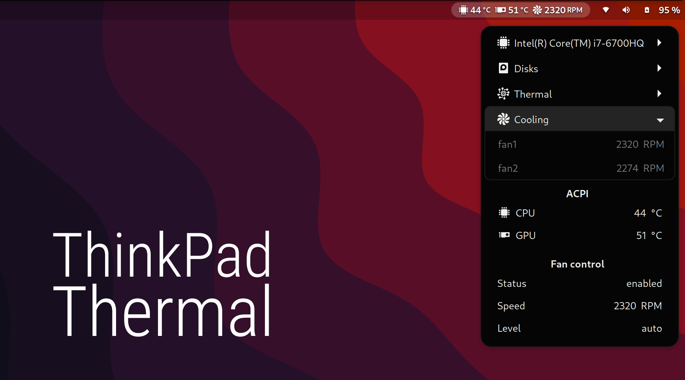

# ThinkPad Thermal GNOME Shell Extension
<b>Extension that displays thermal and fan status on ThinkPads</b>

## Requirements
- [thinkpad-acpi](https://www.kernel.org/doc/Documentation/laptops/thinkpad-acpi.txt), check contents of `/proc/acpi/ibm/thermal` and `/proc/acpi/ibm/fan`
- [lm-sensors](https://github.com/lm-sensors/lm-sensors), make sure to run `sensors-detect`
- `lscpu`
- `lsblk`

## Install

### GNOME Extensions Website

This extension is available on [GNOME Extensions Website](https://extensions.gnome.org/extension/986/thinkpad-thermal/).

### Manually

You can clone this repo and build the extension manually with `yarn build:package`, and extract the generated archive from `dist` to your extensions path, ie. `~/.local/share/gnome-shell/extensions/`.

## Troubleshooting

- Make sure you have the required dependencies installed and configured
- Run `./run-log.sh` and check the generated logs `hw.log, err.log`
- Clone the repo, install dependencies, `yarn dev` and `./run-nested-shell.sh`

## Todo
  - [x] thinkpad-acpi
  - [x] lm-sensors
  - [x] lscpu
  - [x] lsblk
  - [x] Fan speed control
  - [x] Settings dialog
  - [ ] Multilang
